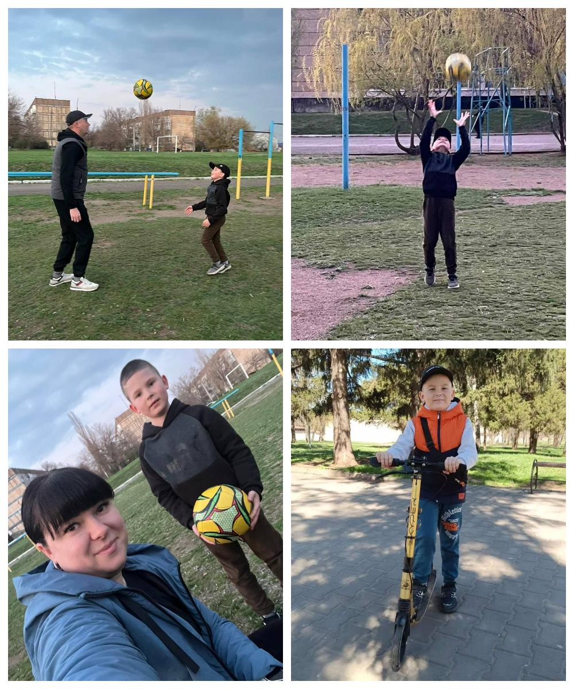

---
title: "Міський фоточелендж #КорисніСімейніЗвички до Дня здоров'я"
---

Спільні заняття різними видами спорту — це корисна та цікава сімейна традиція. У родині Дмитріва Костянтина, учня 1-А класу, дуже полюбляють активні та рухливі ігри на свіжому повітрі. Розваги з мʼячем, катання на велосипеді, роликах, зарядка серед природи - це не тільки цікаво і весело, а ще й дуже корисно для здоров’я. Дружна родина Костянтина дотримується девізу: «Рух - це життя!», тому завжди проводить вільний час активно. 

Заняття спортом всією сім’єю формують правильну звичку, зміцнюють і зберігають здоров’я, допомагають стати ближчими та уважнішими одне до одного.

