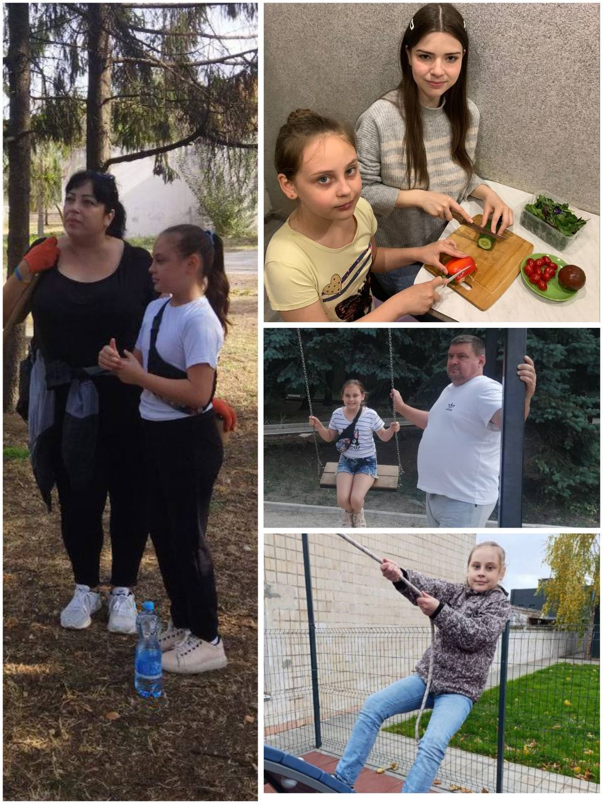

---
title: "Міський фоточелендж #КорисніСімейніЗвички до Дня здоров'я"
---

Родина Забелло обирає активність, турботу та корисні звички!

Надійка з 3-А класу впевнена: сімейний відпочинок — це не лише про розваги, а й про спільні корисні справи. Разом із батьками вона відвідує парки, допомагає дбати про чистоту навколишнього середовища та проводить час на свіжому повітрі. А вдома — час для затишку, сміху та приготування смачних і здорових страв разом із сестрою!

Такі миті єдності дарують тепло, навчають підтримки та прищеплюють любов до здорового способу життя. Кожен день у родині Забелло — це нова пригода, яка загартовує тіло й душу, надихає на нові досягнення та заряджає енергією!

