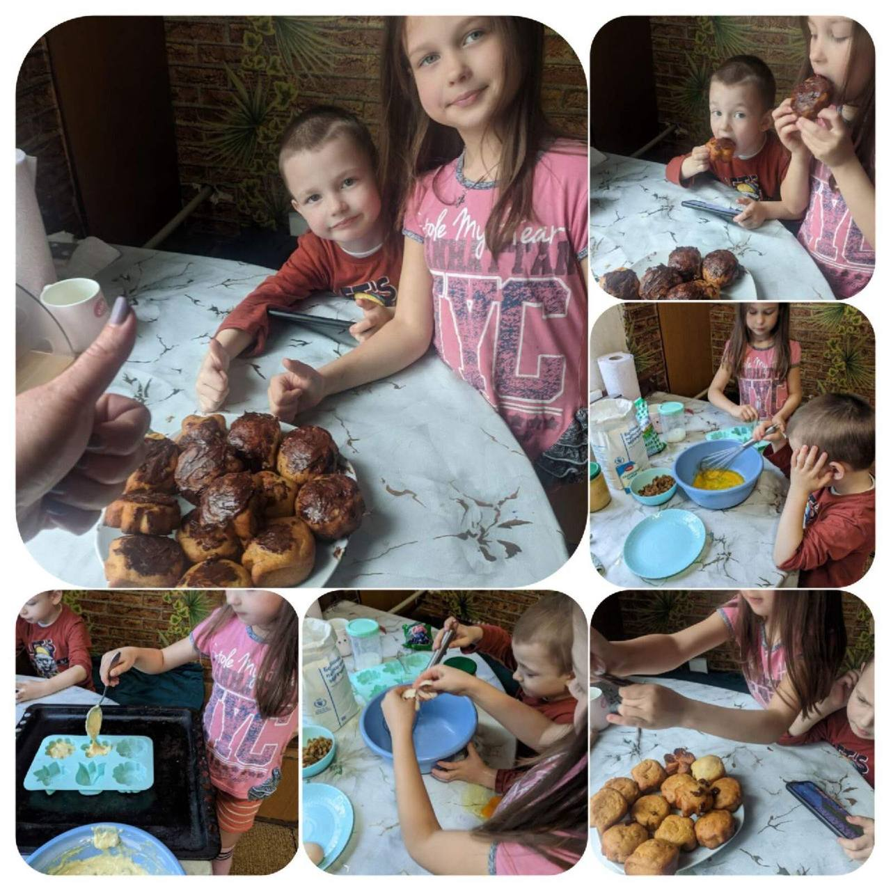

---
title: "Міський фоточелендж #КорисніСімейніЗвички до Дня здоров'я"
---

Як часто ви сідаєте обідати чи вечеряти разом у колі родини? У сучасному шаленому ритмі ми звикли постійно поспішати, купувати фаст-фуд і перекушувати поспіхом. Крім того, діти ростуть, у них з’являються свої друзі та інтереси, а батьки можуть затримуватися на роботі чи ходити на зустрічі, тренування.

Спільне приготування та прийом їжі в сімʼї Соколової Катерини, учениці 1-А класу, стали доброю традицією.

Збиратися всією сім’єю за столом - це прекрасна можливість відчути взаємну підтримку та дізнатися, що відбувається в житті одне одного. Також це зближує всіх членів родини та зміцнює стосунки.

