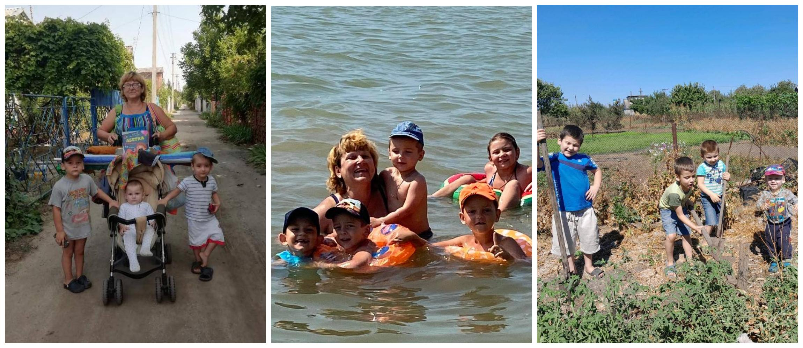

---
title: "Міський фоточелендж #КорисніСімейніЗвички до Дня здоров'я"
---

Активний відпочинок на природі - одне із улюблених занять великої та дружної родини Трофімових. Учні 1-А класу - Трофімов Владислав та Трофімов Нікіта - прихильники здорового та активного проведення часу з найріднішими. Брати, сестри, батьки, дідусь з бабусею полюбляють прогулянки на свіжому повітрі, де із задоволенням грають у рухливі ігри. Найкращими друзями родини є сонце, повітря і вода, які допомагають загартовувати всіх членів сімʼї!

