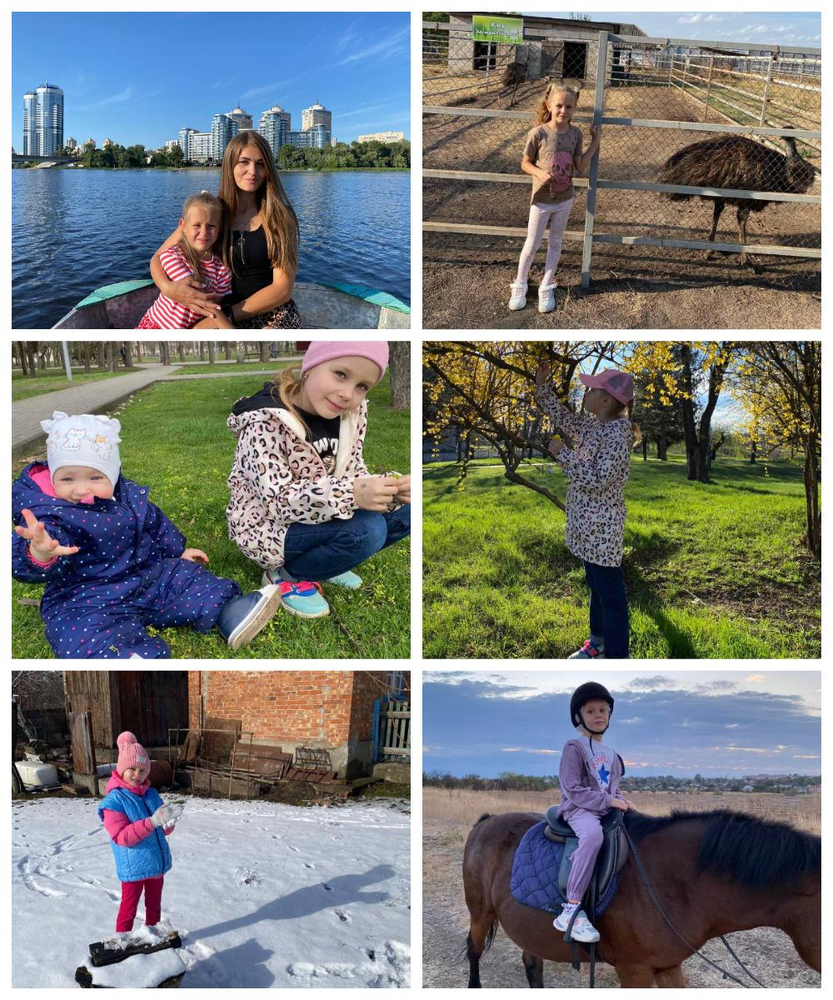

---
title: "Міський фоточелендж #КорисніСімейніЗвички до Дня здоров'я"
---

1-А клас. Родина Майстренко Єлизавети дуже полюбляє подорожувати та разом відкривати нові куточки нашої країни, які надихають своєю красою. Родинні подорожі - це чудова традиція, яка дає можливість поділитися враженнями та емоціями з найріднішими людьми.

