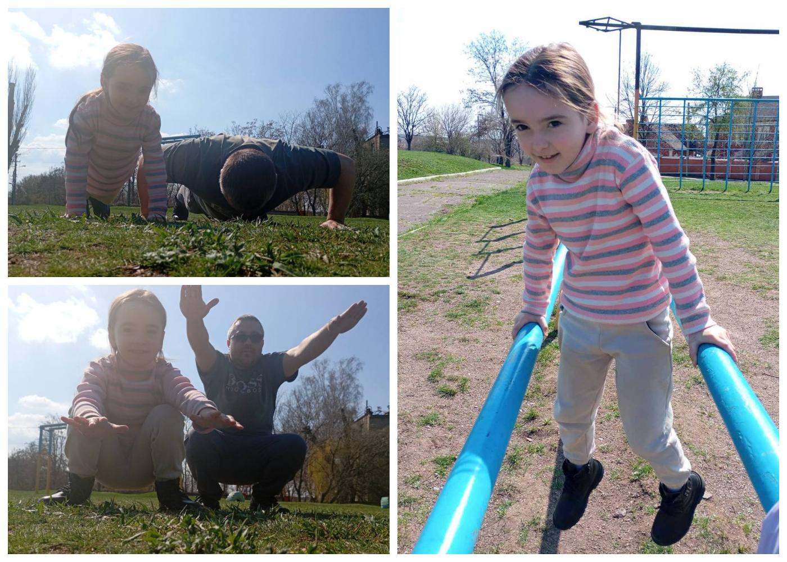

---
title: "Міський фоточелендж #КорисніСімейніЗвички до Дня здоров'я"
---

Одним із улюблених захоплень родини Мурої Софії, учениці 1-А класу, є зарядка на свіжому повітрі. Виконання фізичних вправ у дружньому родинному колі серед мальовничих краєвидів рідного міста допомагають відчувати себе бадьорим та отримати прилив сил на цілий день.

Спорт - це гарантовані натхнення та гарні емоції на кожен день!

