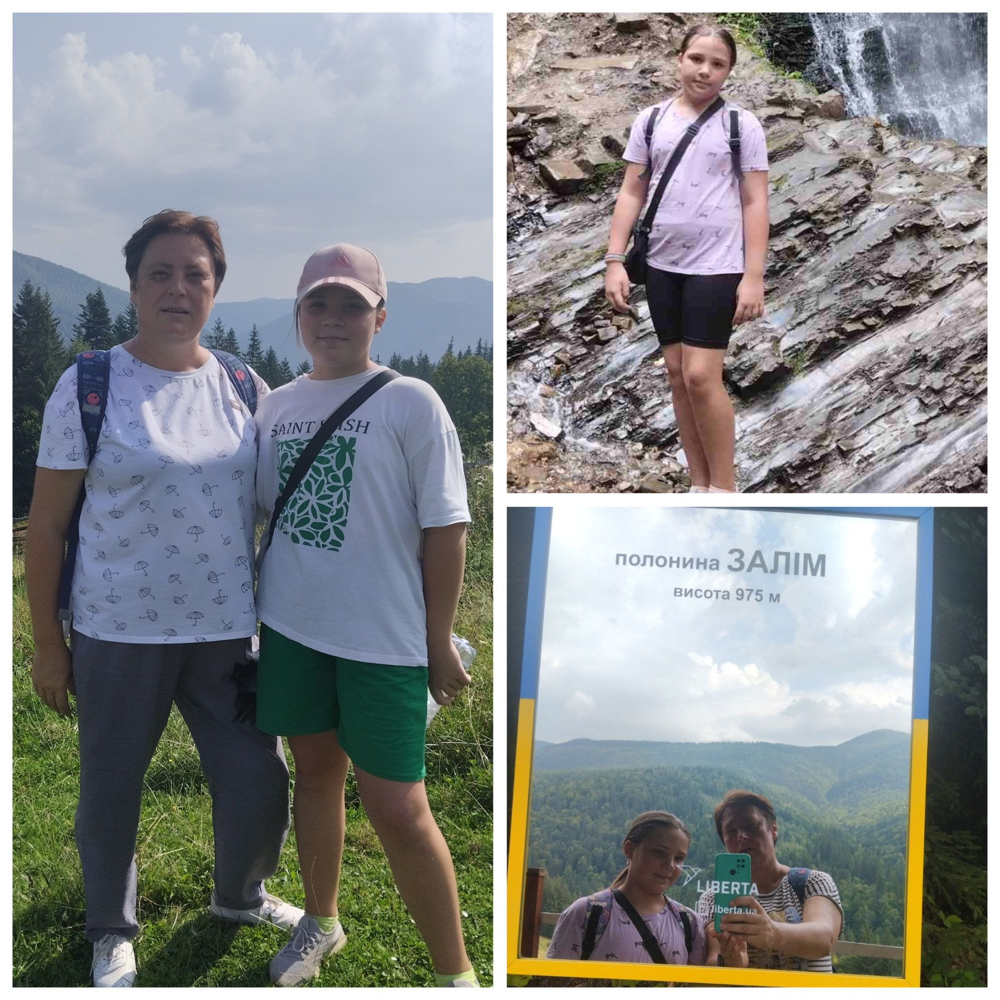

---
title: "Міський фоточелендж #КорисніСімейніЗвички до Дня здоров'я"
---

Марія ПЛОТНІКОВА, 5-Б клас.

Активний оздоровчий відпочинок – це чудовий спосіб зміцнити здоров’я та фізичної форми. Включаючи в себе різноманітні види активностей, цей вид відпочинку сприяє загальному покращенню психічного благополуччя.

