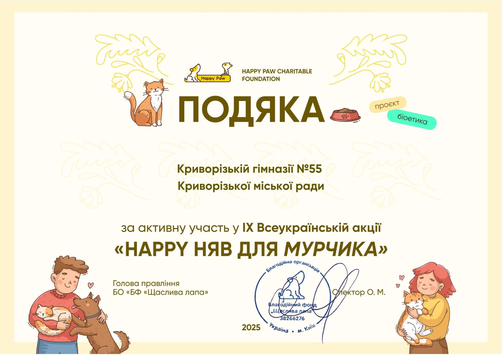

---
title: Волонтерська робота. Допомога безпритульним тваринам
---

У рамках Міської волонтерської акції «Дитячі добрі справи – рідному місту», що відбулася у КГ №55 КМР, було проведено активну волонтерську роботу, яка стала частиною ІХ Всеукраїнської акції «Happy Няв для Мурчика». Особлива подяка батькам, учням та ученицям, педагогам, які активно долучилися до організації акції та сприяли її успішному проведенню. Ваша підтримка й участь у такому благородному заході є важливою частиною формування в учнів почуття відповідальності, співчуття та бажання допомагати. Завдяки спільним зусиллям ми можемо зробити наше місто більш турботливим і чуйним до потреб безпритульних тварин.

