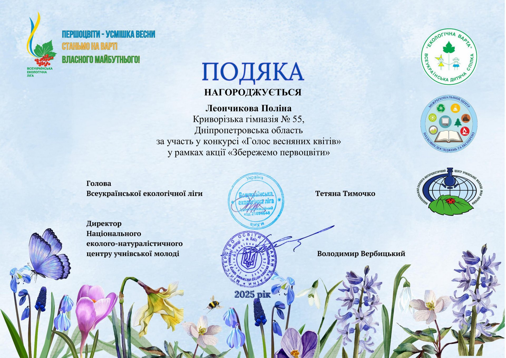

Щороку Всеукраїнська дитяча спілка «Екологічна варта» за підтримки Всеукраїнської екологічної ліги проводить масштабну природоохоронну акцію «Збережемо первоцвіти». Однією з яскравих її частин став творчий конкурс «Голос весняних квітів», який об'єднав талановитих учасників з усіх 24 областей України та міста Києва!

🌼 У 2025 році до конкурсу надійшло понад 2000 заявок у двох номінаціях!

🎥 Серед активних учасників була й Леончикова Поліна, учениця 9-А класу КГ №55 КМР, яка представила власний відеоролик під назвою «Збережемо первоцвіти». У своїй роботі Поліна творчо та з любов’ю закликала берегти перші весняні квіти, що є символом пробудження природи та краси.

За участь у конкурсі Поліна отримала Подяку, яка є визнанням її екологічної свідомості, активної громадянської позиції та творчого підходу.

👏 Вітаємо Поліну та бажаємо нових звершень на шляху збереження природи!

