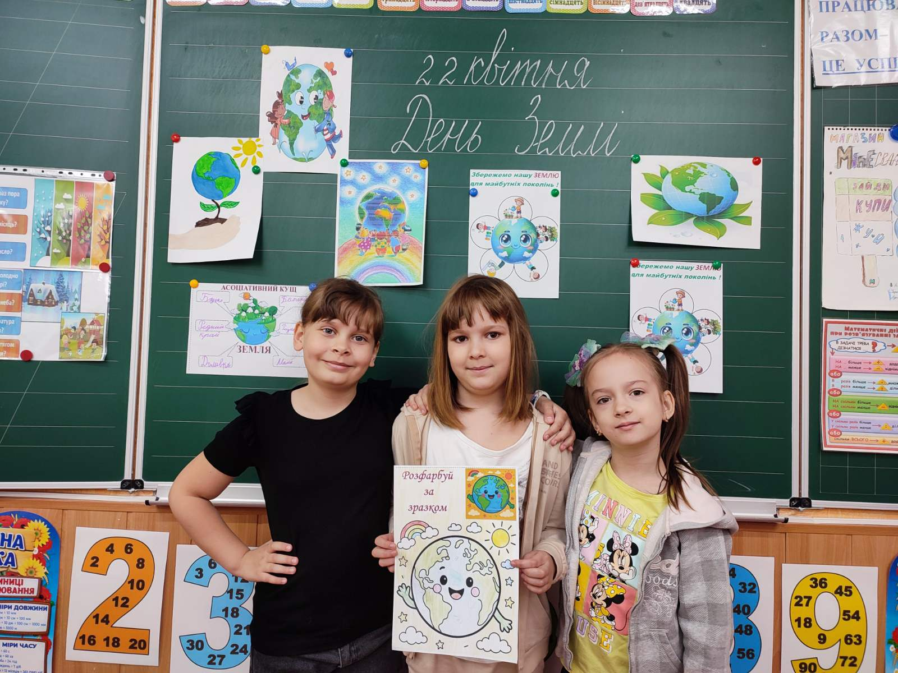

---
title: 🌍 Всесвітній день Землі — 22 квітня 2025 року 🌿
---

Сьогодні учні 2-Б класу нашої гімназії долучаються до святкування Всесвітнього дня Землі, об'єднуючи свої зусилля задля збереження планети. Це важливе свято нагадує нам про необхідність дбати про навколишнє середовище та підтримувати баланс у природі.

