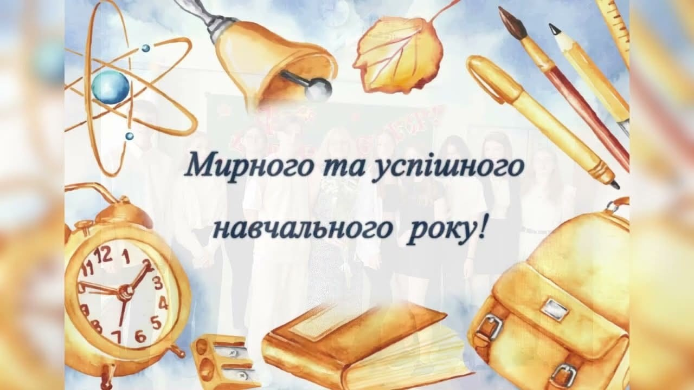

Напередодні Дня знань наш заклад радо готується відчинити двері для своїх учнів, батьків і педагогів, розпочинаючи новий навчальний рік. Це свято завжди сповнене радості, хвилювання та надій, адже воно символізує початок нових звершень, відкриттів і перемог.

Дорогі учні, попереду у вас час нових знань, цікавих відкриттів і яскравих подій. Нехай навчання дарує впевненість у власних силах, а кожен день приносить радість пізнання та спілкування.

Шановні батьки, цей день – особливий і для вас. Адже разом із дітьми ви проживаєте кожен крок їхнього становлення та розвитку. Нехай ваші серця наповнює гордість за їхні успіхи, а терпіння й любов завжди будуть підтримкою для них.

Дорогий педагогічний колектив, саме завдяки вашій самовідданості, мудрості та професіоналізму навчальний рік стане результативним та плідним. Ви надихаєте, виховуєте та допомагаєте дітям упевнено йти до майбутнього.

Нехай цей навчальний рік стане роком нових можливостей, досягнень та миру. Бажаємо всім учасникам освітнього процесу міцного здоров’я, невичерпної енергії, віри в себе та взаємної підтримки.

Хай перший дзвоник пролунає як символ єдності, нових знань і впевненості у завтрашньому дні. Разом ми крокуємо до перемог і майбутнього України!

