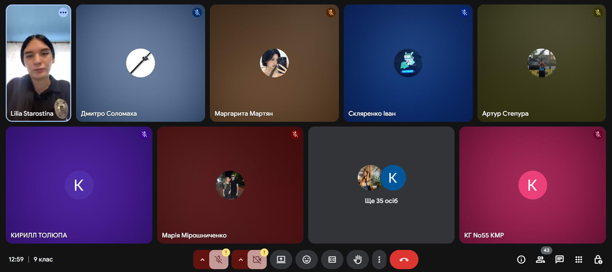

---
title: Зустріч з експертом з питань запобігання вербуванню
---

08.09.2025 зі здобувачами освіти 9-х класів Криворізької гімназії №55 відбулася важлива інформаційна зустріч із Лілією Михайлівною Старостіною, представницею Сектору ювенальної превенції.

Під час заходу учні ознайомилися з основними принципами запобігання вербуванню та отримали поради, як захищати себе та своїх друзів від потенційних ризиків. Лілія Михайлівна доступно розповіла про способи розпізнавання небезпечних ситуацій і підкреслила важливість відповідальної поведінки в соціальних мережах та реальному житті.

