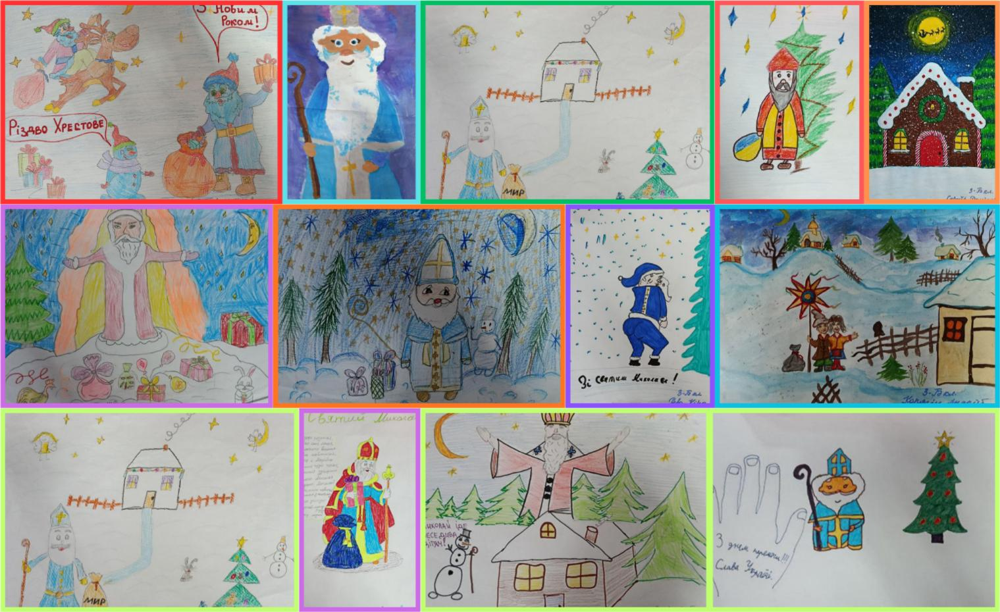
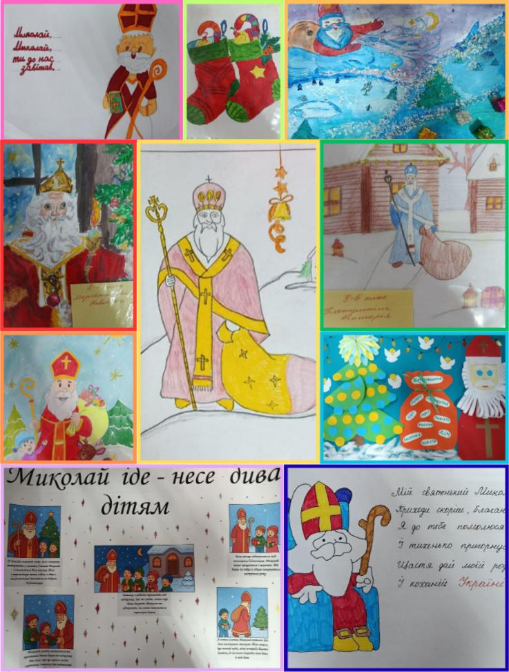

---
title: ✨Акція «Миколай для Захисників»✨
---

Напередодні Міжнародного дня волонтера, 5 грудня, у Криворізькій гімназії №55 відбулася тепла та надзвичайно душевна акція «Миколай для Захисників».

Учні гімназії власноруч створювали яскраві листівки та готували щирі привітання до Дня Збройних Сил України. Кожне слово, кожен малюнок — це подяка, підтримка й віра в наших Героїв, які щодня захищають Україну.

Діти вклали у свої роботи добро і тепло, аби вони стали маленькими промінчиками свята для наших захисників у переддень Дня святого Миколая.

Творити добро може кожен, і навіть маленький жест здатний зігріти серце.

Разом — сильні. Разом — непереможні. 💛💙

