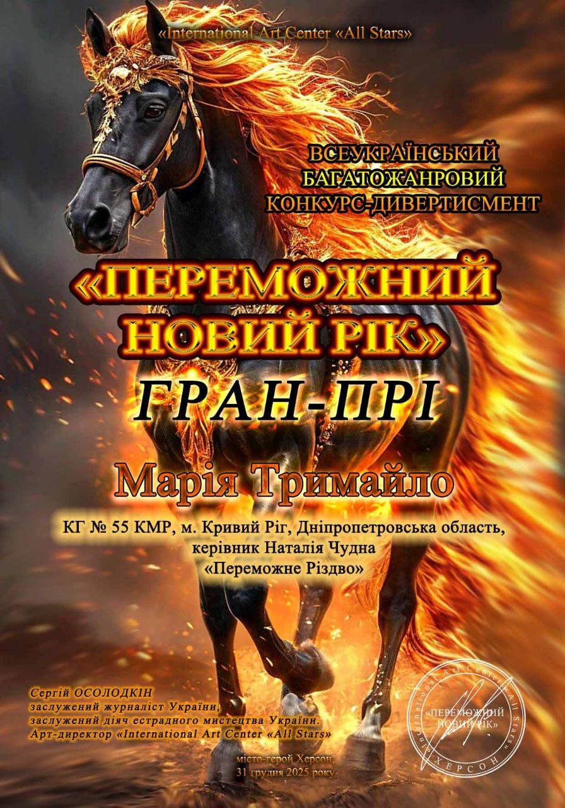

Нещодавно відбувся Всеукраїнський багатожанровий конкурс-дивертисмент «Переможний Новий рік», організований міжнародним арт-центром «All-Stars International» 🎭🎶🎨

🏆 Головну нагороду конкурсу — Гран-прі — здобула талановита учениця Криворізької гімназії № 55 Марія Тримайло!

У жанрі «Образотворче мистецтво» Марія продемонструвала високий рівень художньої майстерності та глибоке емоційне бачення. На розгляд журі була представлена робота «Переможне Різдво», яка вразила своєю щирістю, символізмом і вірою в перемогу. ✨🎄

Окрема подяка наставниці — керівнику Наталії Чудній, чия підтримка та професіоналізм допомагають юним талантам розкриватися та сяяти. 🌟

💙💛 Успіх Марії Тримайло — це ще один яскравий доказ того, що українська молодь продовжує творити, мріяти й перемагати навіть у найскладніші часи. Пишаємось і бажаємо нових творчих звершень! 🎨🏆🇺🇦

