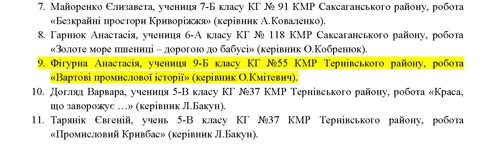
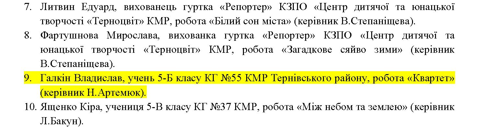

Криворізька гімназія №55 щиро вітає наших талановитих учнів з перемогами у міському заочному юнацькому конкурсі фото- та відеоробіт екологічної тематики «Криворізькі кадри – 2026», тематика якого цього року — «Кривий Ріг – моє місто». 🏙️💚

У номінації «Фото» 🖼️✨ 🥇 І місце посіла Фігурна Анастасія, учениця 9-Б класу, із роботою «Вартові промислової історії» (творчий керівник — Олексій Кмітевич). 👏 🥉 ІІІ місце здобув Галкін Владислав, учень 5-Б класу, із роботою «Квартет» (творчий керівник — Наталія Артемюк). 🌟

Пишаємося вашими досягненнями, творчим баченням та любов’ю до рідного міста 📷❤️

Бажаємо натхнення, сміливих ідей, нових відкриттів і майбутніх перемог! 🚀🏆

<gallery>

</gallery>
