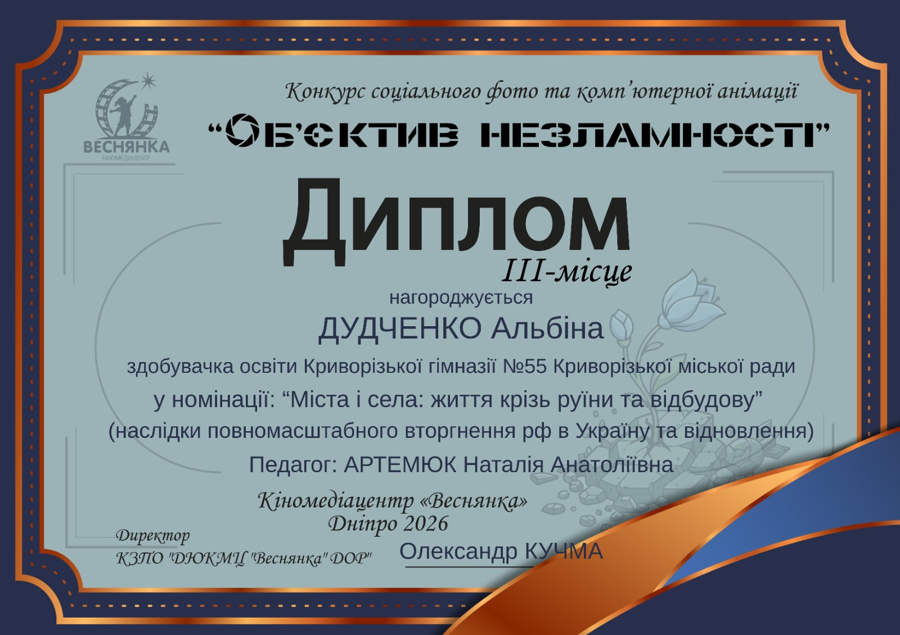
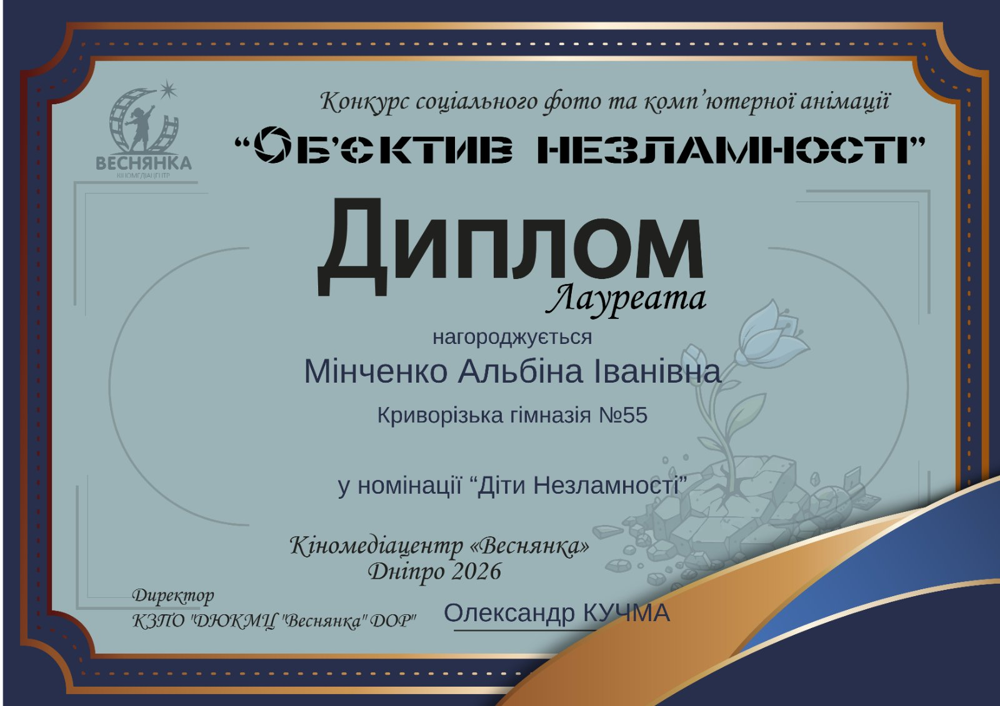

Криворізька гімназія №55 щиро вітає ученицю 8-А класу Альбіну Дудченко з почесним ІІІ місцем в Обласному конкурсі соціального фото та комп’ютерної анімації 🏆та Альбіну Мінченко, ученицю 5-Б класу, яка стала лауреаткою цього конкурсу. 🌟

Творчий наставник і керівник — Наталія Артемюк. 👩‍🏫✨

Дівчатка — справжні майстрині фотографії. 📷💫 Бажаємо кожній з вас невичерпного натхнення, яскравих ідей та нових перемог! 🚀🎉

<gallery>

</gallery>
