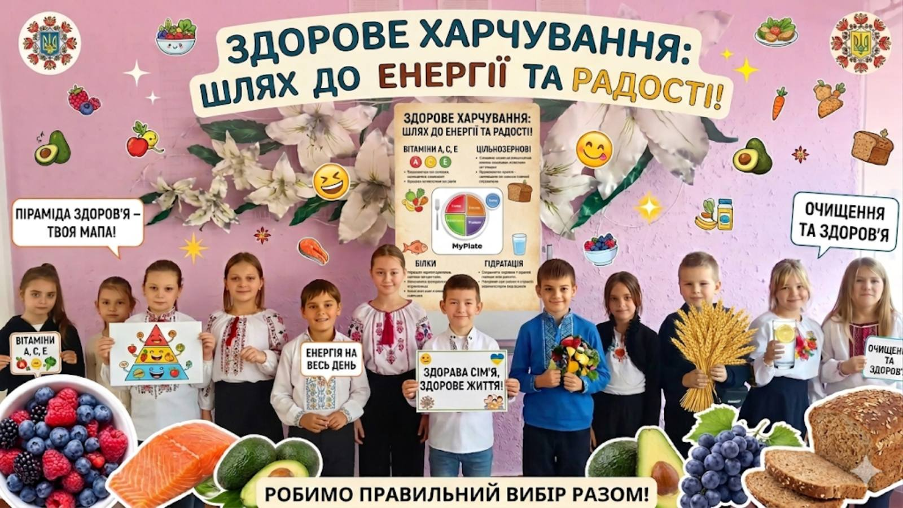
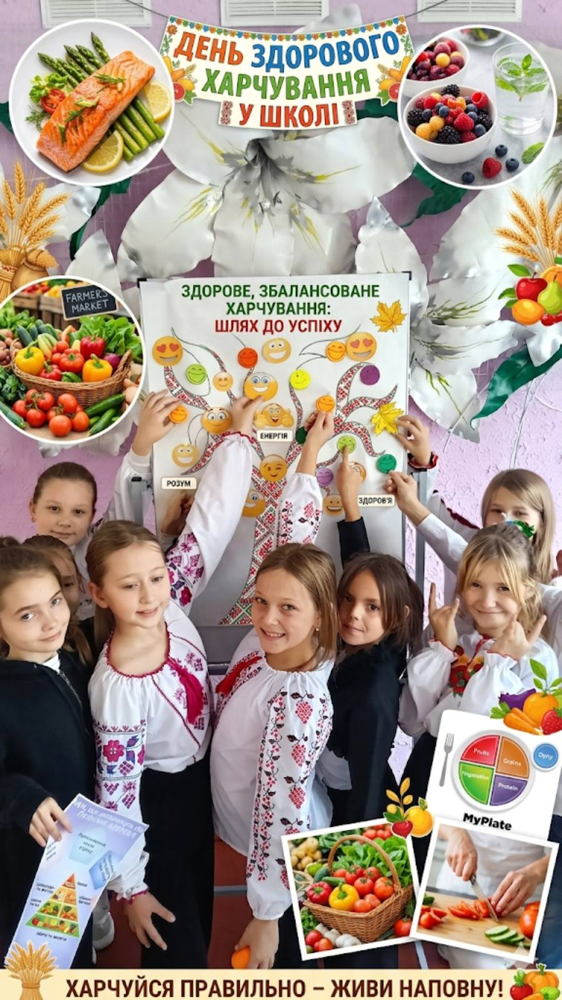

Сьогодні у 4-му класі говорили про те, як їжа впливає на наші оцінки та настрій. На виховній годині «Здорове та збалансоване харчування» учні стали справжніми експертами з раціону!

🕵️‍♂️ Разом із вчителем ми:

- Дослідили склад ідеальної «Тарілки здоров’я».
- Дізналися, чим замінити некорисні перекуси.
- З’ясували, чому сніданок — це секрет продуктивного дня.

Впевнені, що тепер кожен школяр зробить вибір на користь вітамінів! А що сьогодні у вашому «корисному списку»? 🍏🥕

<Gallery>

</Gallery>
