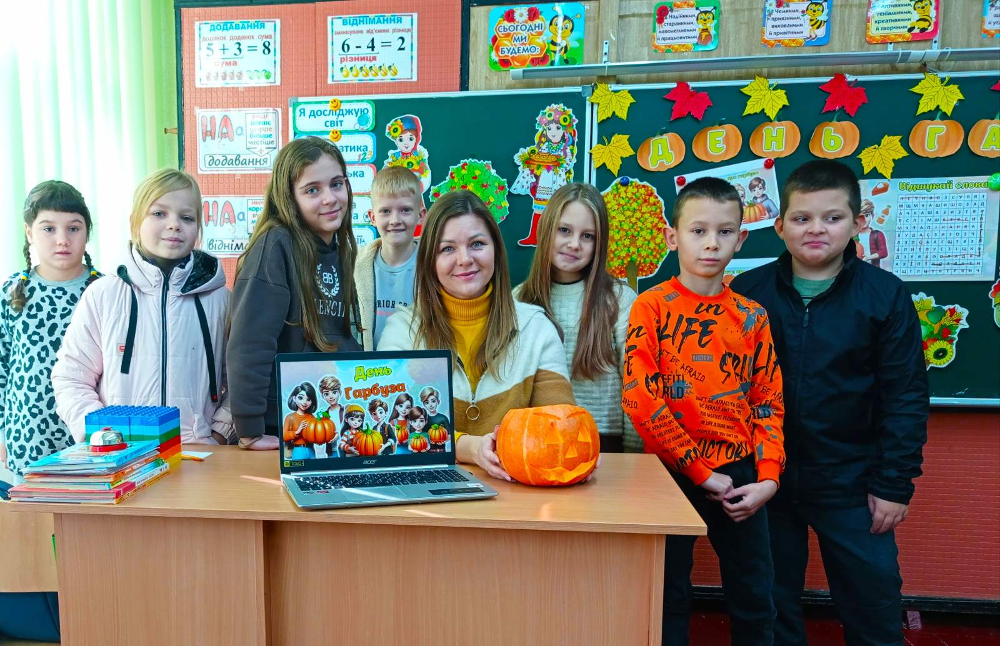
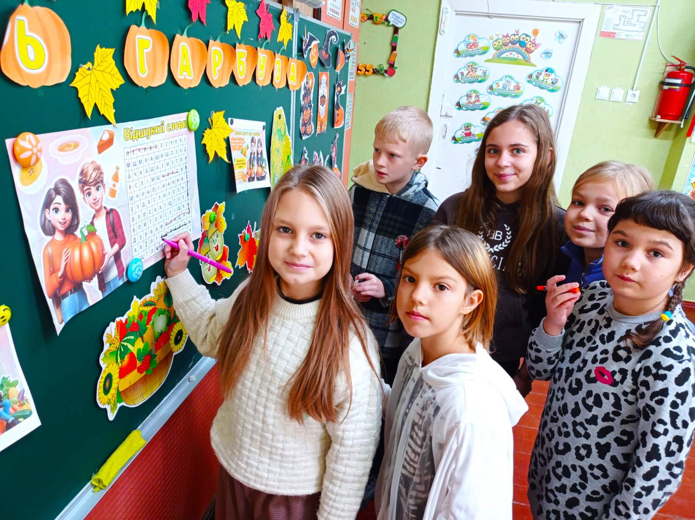

---
title: "🍎 Здоров’я на тарілці: як у нашому закладі пройшов захід про здорове харчування"
---

Чи може урок бути одночасно корисним, смачним і неймовірно цікавим? Так, якщо це захід, присвячений культурі харчування та нашому помаранчевому фавориту — гарбузу! 🎃

12 березня разом з учнями 1-Б класу ми влаштували справжнє дослідження здорових звичок. Під керівництвом вчителя класного керівника Таран Н. В. школярі:\
✅ Досліджували склад «вітамінного кошика»: дізналися, чому гарбуз — це суперфуд для зору, мозку та імунітету.\
✅ Грали в «мовну кухню»: пригадували фразеологізми про їжу та вчилися описувати корисні продукти, використовуючи відокремлені члени речення.\
✅ Рахували вітаміни: за допомогою числівників складали рецепти ідеального сніданку та розраховували водний баланс.\
✅ Обговорювали етикет: нагадали собі, що культура споживання їжі так само важлива, як і її склад.

Такі заходи допомагають дітям зрозуміти: здорове харчування — це не про обмеження, а про енергію, гарний настрій та успішне навчання! 💪🍏

Обираймо корисне, споживаймо вітчизняне та дбаймо про себе разом!

<Gallery>

</Gallery>
