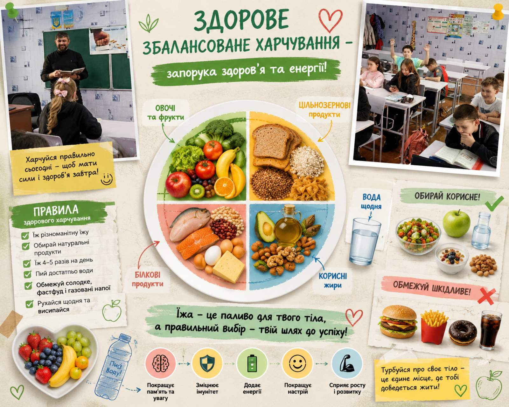
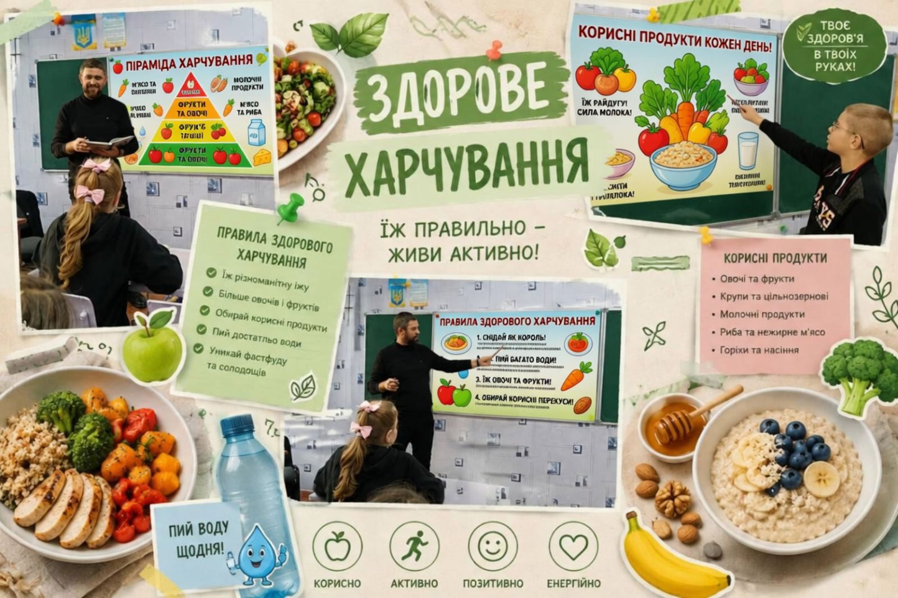
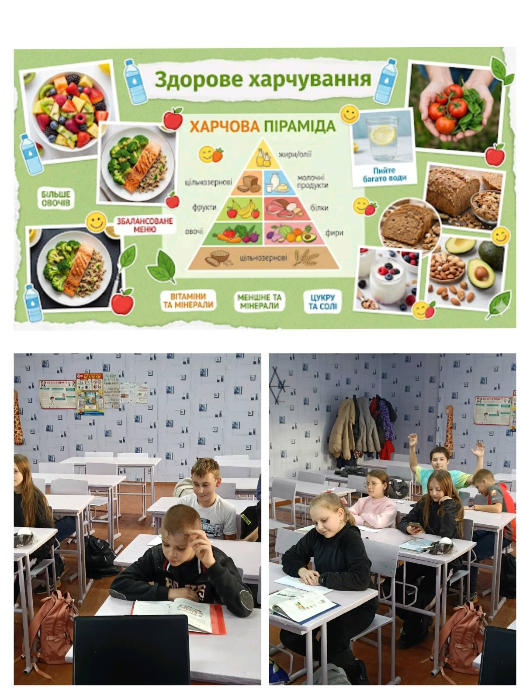

---
title: Корисне = Смачне! Доведено учнями 6-го класу ✅🥕
---

Наші шестикласники влаштували справжній «вітамінний ревізор» на уроці, присвяченому збалансованому харчуванню.

Що ми встигли?\
🍎 Розвінчали міфи про шкідливі перекуси.\
🍎 Розгадали складні «вітамінні» загадки.\
🍎 Склали власне ідеальне меню, де є місце і користі, і задоволенню.

Віримо, що тепер вибір на користь здоров'я стане для наших учнів приємною щоденною звичкою. ✨📸

<Gallery>

</Gallery>
