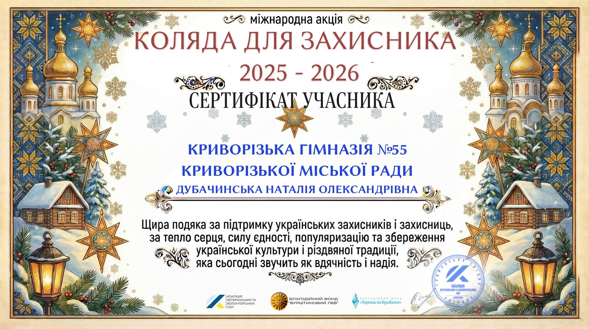

---
title: 🎶✨ Міжнародна акція «Коляда для захисника 2025–2026» ✨🎶
---

Раді повідомити, що Наталія Дубачинська, учитель музичного мистецтва, долучилася до міжнародної акції «Коляда для захисника 2025–2026».

Її участь — це творчий внесок та щирий прояв підтримки українських захисників і захисниць. Через музику, колядки та різдвяні традиції вона передає тепло серця, силу єдності та віру в перемогу.

Наталія Дубачинська отримала сертифікат учасника як знак вдячності за популяризацію і збереження української культури, яка сьогодні звучить особливо — як символ надії, вдячності та незламності.

💙💛 Разом зберігаємо традиції. Разом підтримуємо. Разом перемагаємо.

