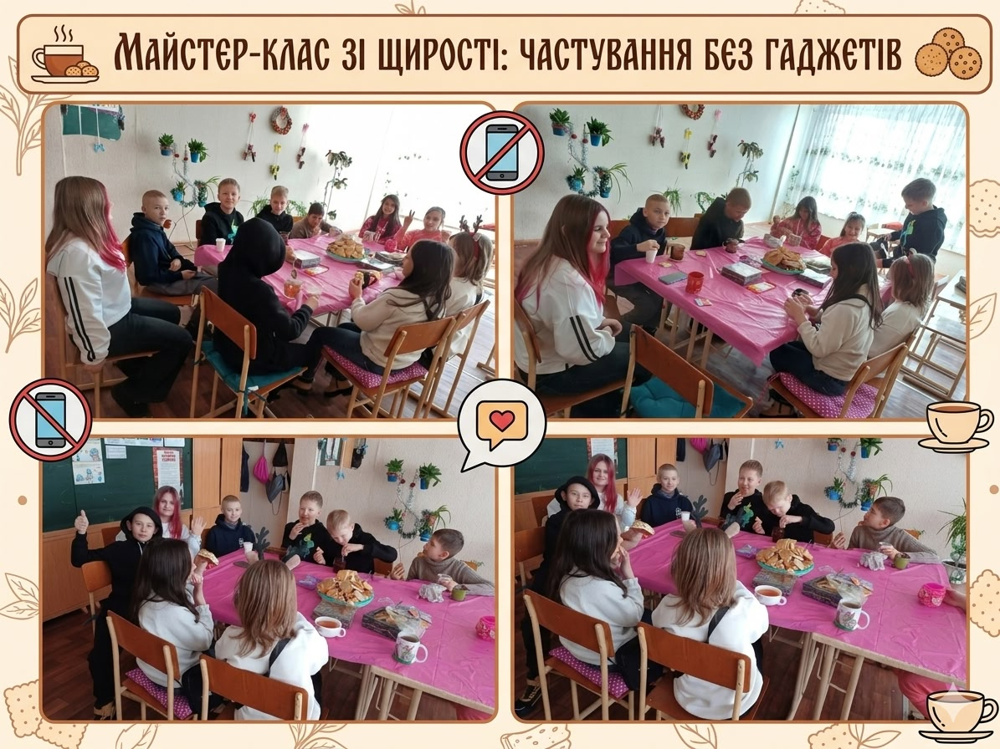

---
title: "🍎 Майстер-клас зі щирості: частування без гаджетів та з користю для здоров’я"
---

Наш «Майстер-клас зі щирості» став справжнім острівцем живого спілкування для учнів 5-Б класу. Головне правило зустрічі — смартфони залишаються в стороні, а на перший план виходять щирість та смачна їжа.

П’ятикласники вчилися мистецтву гостинності та правилам етикету. Але найважливішим уроком стало усвідомлене харчування. Діти дізналися: коли ми відкладаємо гаджети під час їжі, наш організм краще засвоює вітаміни, а ми швидше відчуваємо ситість і справжній смак продуктів. 🥦✨

Замість гортання стрічок соцмереж, діти насолоджувалися настільними іграми, корисними перекусами та теплим чаєм. Практикум з «цифрового етикету» довів: увага до співрозмовника та повага до власного здоров’я цінніші за будь-які вподобайки.

Найсмачніші та найкорисніші моменти життя трапляються саме в режимі «офлайн»! ☕🧩

