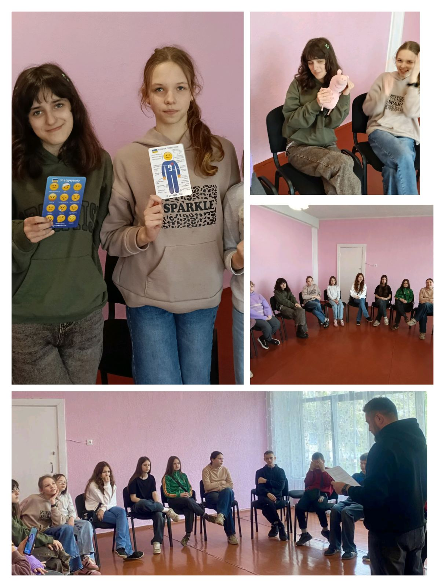
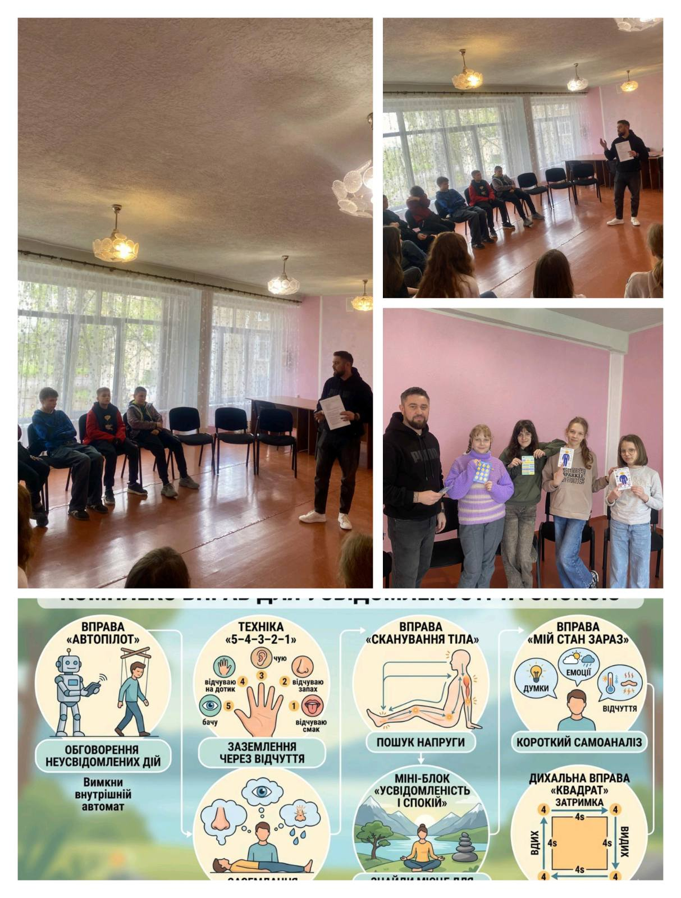

---
title: 🧠✨ Тиждень психології у дії!
---

21.04.26 із учнями 6-х класів було проведено тематичний захід, спрямований на розвиток усвідомленості та емоційної саморегуляції. 💙

Під час заняття учні познайомилися та практикували ефективні техніки:\
🌿 «5–4–3–2–1» — для повернення у стан «тут і зараз».\
🌬️ «Коробкове дихання» — для зниження тривожності та напруження.\
🧘‍♀️ «Сканування тіла» — для кращого відчуття власного стану.\
💭 Вправа «Мій стан зараз» — для усвідомлення емоцій.

Заняття сприяло зниженню емоційного напруження, покращенню психоемоційного стану та формуванню навичок турботи про себе. 🌈

Разом навчаємося розуміти себе та дбати про внутрішню гармонію. 💫

<Gallery>

</Gallery>
