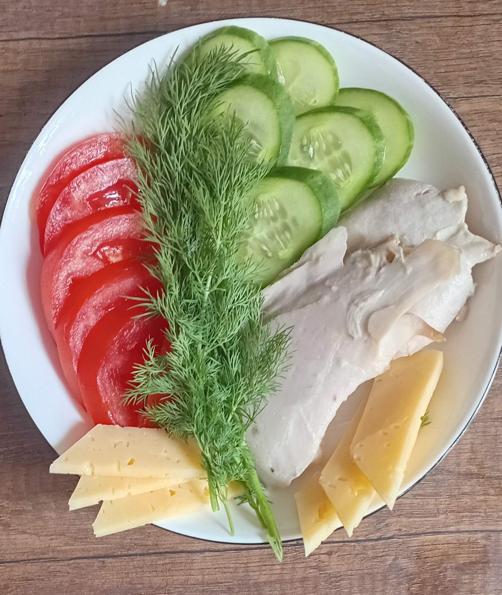

---
title: Секрети енергійності від 6-го класу! ⚡🥗
---

Сьогодні на уроці технологій ми розкривали «формулу» ідеального харчування. Тема надзвичайно актуальна: «Основи раціонального харчування та культура споживання їжі».

Що дізналися учні?\
🔹 Як білки, жири та вуглеводи допомагають нам рости й навчатися.\
🔹 Як правильно планувати свій режим дня.\
🔹 Чому сніданок — це «золоте правило» енергійного ранку. 🥐☕

Ми впевнені: культура харчування починається з усвідомленого вибору. А коли ти готуєш сам — їжа стає ще смачнішою та ціннішою! 😋👩‍🍳

<Gallery>

</Gallery>
