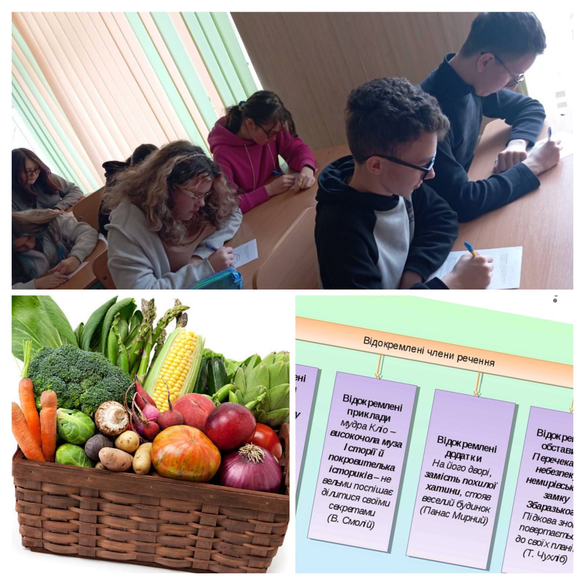

---
title: Що у вашому кошику? 🤔🍎
---

6 травня учні 8-А клас на уроці української мови (вчитель Добровольська В. Е.) збирав свій ідеальний набір продуктів для здоров’я. Але робили ми це за допомогою... відокремлених членів речення!

✍️ Писали есе, де кожна кома допомагала підкреслити користь обраної страви.\
🥕 Обирали овочі, «насичені вітамінами».\
🍎 Смакували фруктами, «соковитими та солодкими».

Результат: відточені навички пунктуації та чітке розуміння, як зробити свій раціон (і свої тексти!) кращими.

