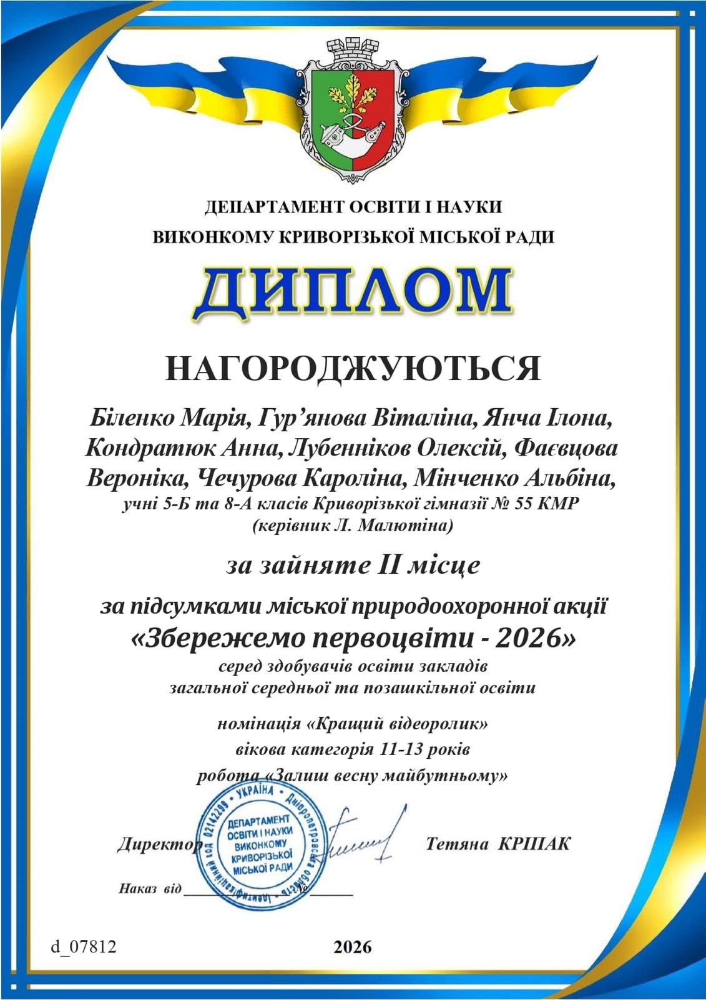

---
title: 🌱 Наші першоцвіти під захистом! Вітаємо переможців! 🌸
---

Маємо чудові новини! Команда наших талановитих та екосвідомих учнів здобула почесне ІІ місце у міській природоохоронній акції «Збережемо першоцвіти — 2026»! 🏆

У номінації «Кращий відеоролик» їхня робота «Залиш весну майбутньому» підкорила журі своєю щирістю, креативністю та важливим меседжем.

🎉 Вітаємо наших героїв:

- Біленко Марію, Гур’янову Віталіну, Янчу Ілону, Кондратюк Анну, Лубеннікова Олексія, Фаєвцову Вероніку, Чечурову Кароліну, Мінченко Альбіну.

Окрема подяка наставнику та натхненнику — керівнику Людмилі Малютіній, під чиїм чуйним керівництвом ідеї перетворилися на такий потужний результат! 💪✨

Пишаємося вашою небайдужістю! Ви — голос весни, який закликає до збереження тендітної краси нашої планети. Бажаємо нових творчих злетів та екологічних перемог! 🌍❤️

