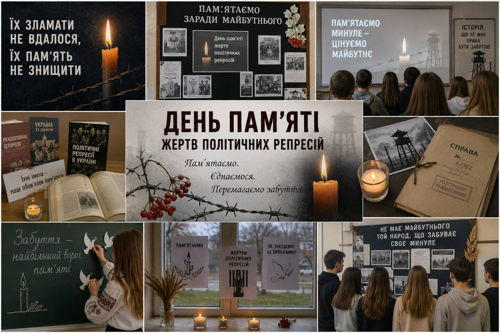
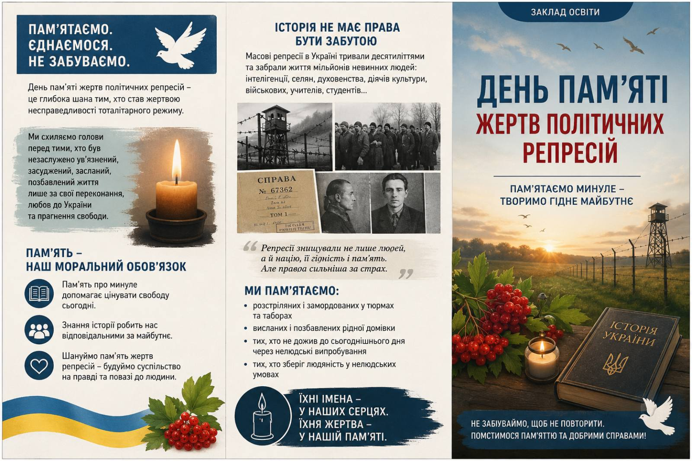

---
title: "«Пам’ять, що карбує волю: 70-ті роковини Великого терору»"
---

У закладі освіти відбулися пам’ятні заходи до 70-х роковин Великого терору — страшної сторінки нашої історії, що забрала тисячі невинних життів. Учні та педагоги зі скорботою вшанували пам’ять жертв масових політичних репресій, згадали тих, хто постраждав за право бути українцем, говорити правду та любити свою Батьківщину.

Через тематичні години пам’яті, виставки та патріотичні бесіди молодь усвідомлює ціну людської свободи й важливість збереження історичної пам’яті.

Пам’ятаємо… Щоб трагедії минулого ніколи не повторилися. 🕯️🇺🇦

<Gallery>

</Gallery>
