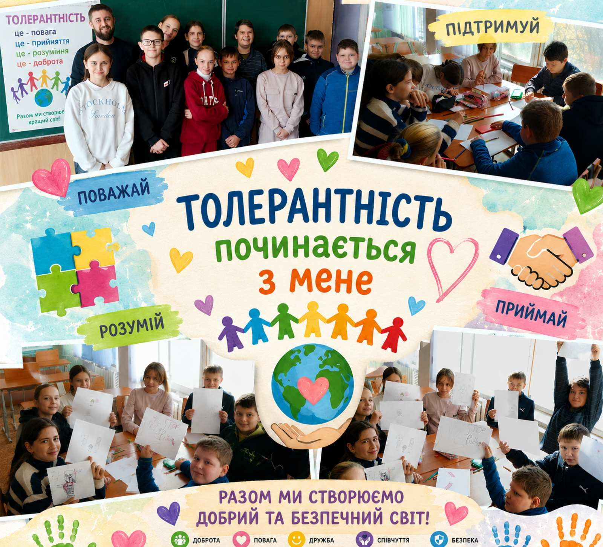
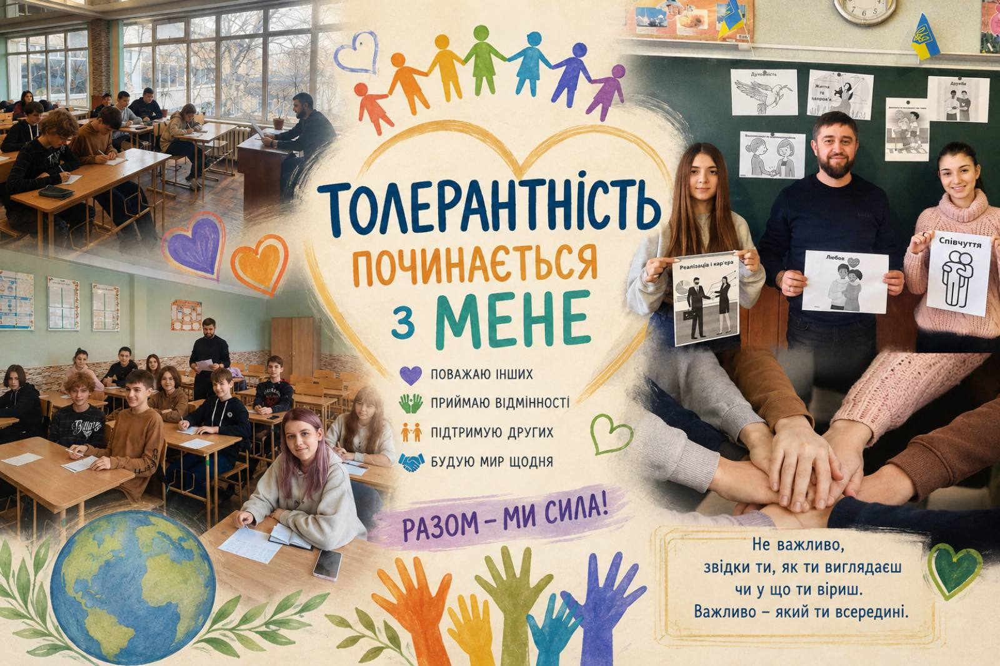

---
title: "Світ без бар’єрів: толерантність починається з кожного з нас! 🤝✨"
---

Світ різноманітний, і саме в цьому його краса! У межах Тижня безбар’єрності для учнів 6–9 класів нашого закладу відбувся захопливий та надзвичайно важливий захід «Толерантність починається з тебе».

Сучасний світ вимагає від нас бути відкритими, чуйними та готовими підтримати тих, хто поруч. Разом із учнями ми розбиралися, що ж таке справжня безбар’єрність, чому мова поваги є такою важливою та як кожен із нас може зробити свій внесок у створення простору, де комфортно усім.

Як це було?

🧠 Інтерактивний діалог: обговорили, чому толерантність — це не просто слово, а щоденний вибір, повага до чужих кордонів та прийняття відмінностей.

🧩 Практичні вправи та кейси: розбирали реальні життєві ситуації, вчилися розпізнавати приховані бар’єри у спілкуванні та руйнувати стереотипи.

💬 Відкритий мікрофон: підлітки активно ділилися своїми думками про те, як зробити наше шкільне середовище ще більш дружнім та інклюзивним.

Наші учні вкотре довели: вони ростуть свідомими, чуйними та небайдужими громадянами, які розуміють, що єдність — у нашому різноманітті!❤️

<Gallery>

</Gallery>
