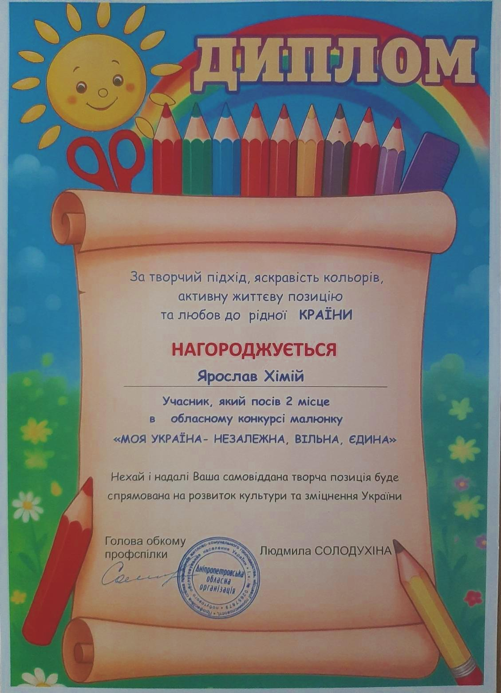

---
title: Творчий успіх! 🎨
---

Ярослав Хімій із 7-А класу посів 2 місце в обласному конкурсі малюнку «Моя Україна – незалежна, вільна, єдина»! 🇺🇦💙

Його робота вирізняється яскравими кольорами та щирою любов'ю до рідної країни. Приємно бачити такі таланти серед наших учнів і розділяти радість цієї перемоги.

Бажаємо Ярославу нових ідей, натхнення та успіхів у всіх починаннях!

