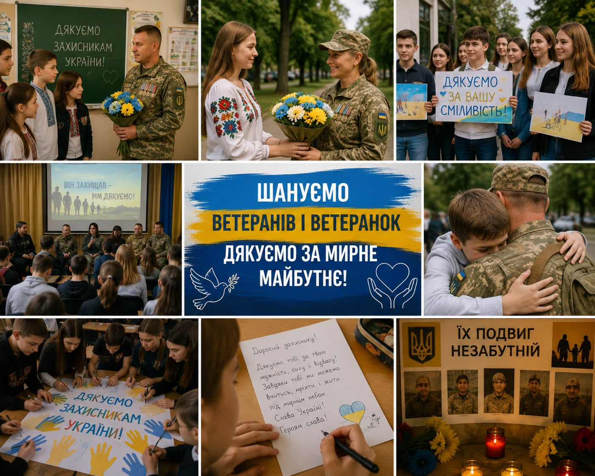

---
title: Інформаційний дайджест "Вшанування ветеранів і ветеранок війни"
---

🇺🇦 Пам’ятаємо. Шануємо. Дякуємо!

У нашому закладі освіти відбулися патріотичні акції, присвячені вшануванню подвигу Героїв сучасної російсько-української війни.

Здобувачі освіти долучилися до написання листів подяки захисникам і захисницям України, у яких висловили щирі слова вдячності за мужність, силу та відданість Батьківщині.

💙💛 Пам’ять про Героїв живе в наших серцях, а слова вдячності допомагають формувати покоління, яке знає ціну свободи та миру.

Дякуємо нашим захисникам і захисницям!

Шануємо. Пам’ятаємо. Підтримуємо. 🇺🇦

