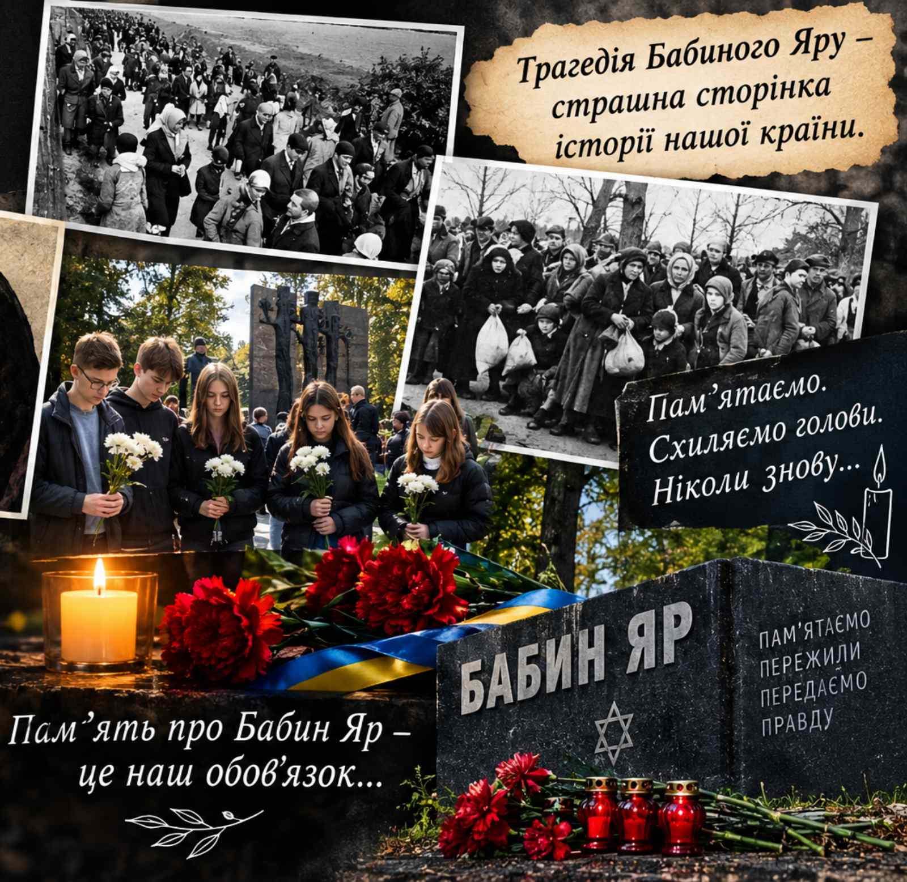
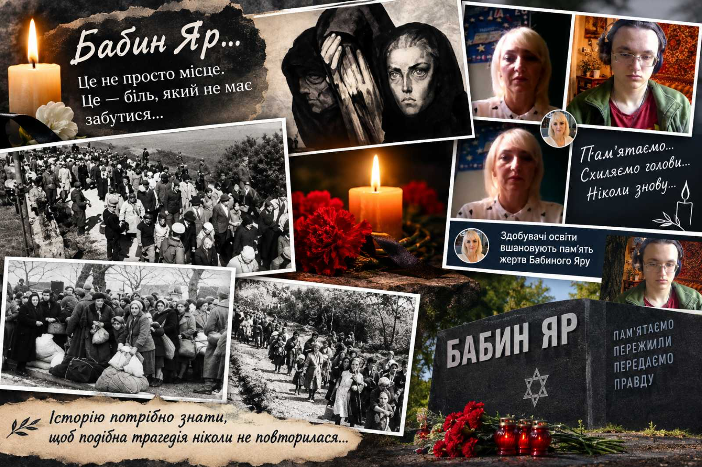

---
title: 🕯️ Пам’ятаємо. Не забудемо
---

Здобувачі освіти вшанували пам’ять жертв трагедії Бабиного Яру — однієї з найстрашніших сторінок історії України та людства.

У цей день ми схиляємо голови перед невинними жертвами, запалюємо свічку пам’яті та нагадуємо собі: історію потрібно знати, щоб подібна трагедія ніколи не повторилася.

🕯️ Пам’ять — наш обов’язок.

<Gallery>

</Gallery>
