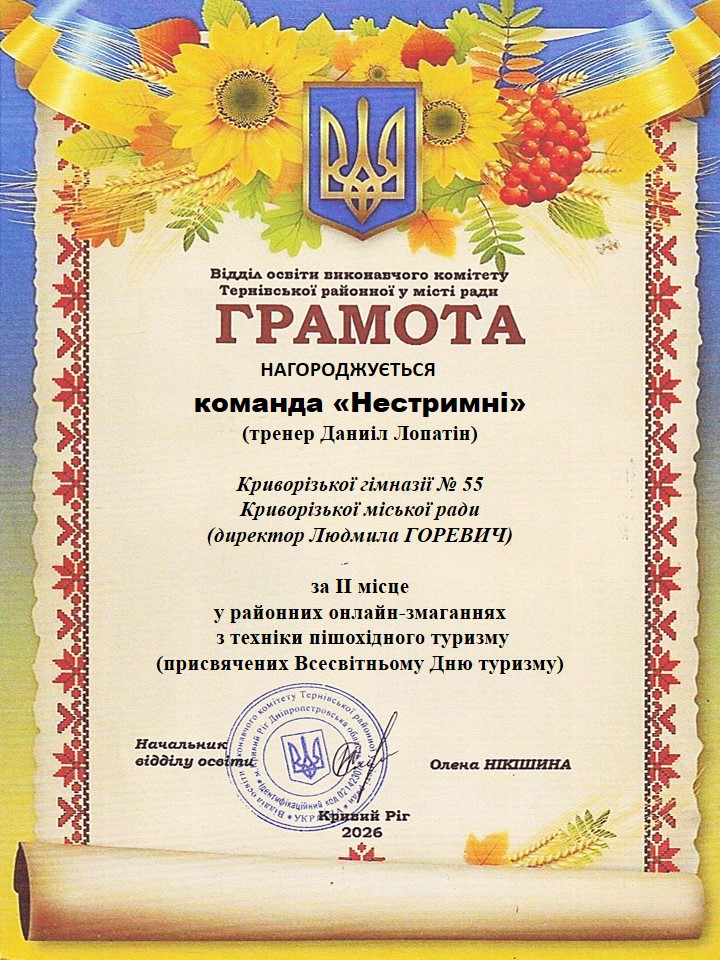

---
title: "🏆 Нові досягнення та чудові результати!"
---

Команда «Нестримні» Криворізької гімназії № 55 виборола почесне II місце у районних онлайн-змаганнях з техніки пішохідного туризму, присвячених Всесвітньому Дню туризму!

👏 Вітаємо наших дев’ятикласників: Василісу Авраменко, Софію Іщенко, Вікторію Лісневську, Гліба Зілінченка, Владслава Євницького та Михайла Бойка, а також їхнього тренера Даниіла Лопатіна!

Цей результат — доказ наполегливості, гарної підготовки, витримки та справжнього командного духу. 💪🧭
Продемонстровані навички доводять, що справжні туристи готові до будь-яких викликів.

Бажаємо не зупинятися на досягнутому, впевнено йти до нових вершин, підкорювати складні маршрути та здобувати нові перемоги! 🌟

