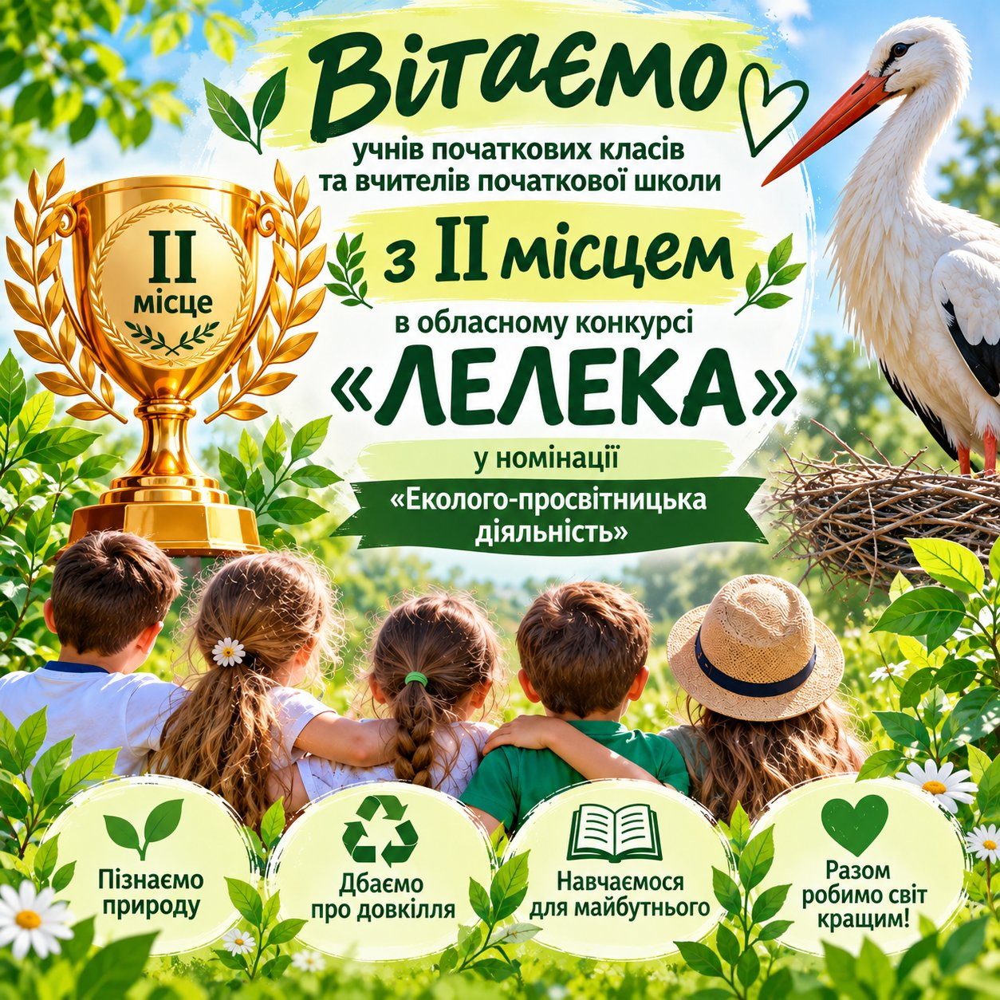

---
title: 🕊️ Пишаємось нашими маленькими екознавцями та їхніми наставниками! 🌿💚
---

Маємо чудову новину! 🎉

Учні початкових класів та вчителі початкової школи Криворізької гімназії №55 вибороли ІІ місце в обласному конкурсі «Лелека» у номінації «Еколого-просвітницька діяльність»! 🏆🌱

Ця відзнака — результат спільної творчої роботи, небайдужості до природи та прагнення змалечку формувати екологічну культуру й відповідальне ставлення до довкілля.

Щиро вітаємо наших юних природолюбів та педагогів! 💐 Дякуємо за активність, цікаві екологічні ініціативи, творчість і любов до рідної природи.

Нехай ця перемога надихає на нові добрі справи, цікаві проєкти та ще більше маленьких кроків заради великого майбутнього нашої планети! 🌍💚

Разом навчаємося берегти природу — разом творимо екологічне майбутнє! 🌿🕊️

