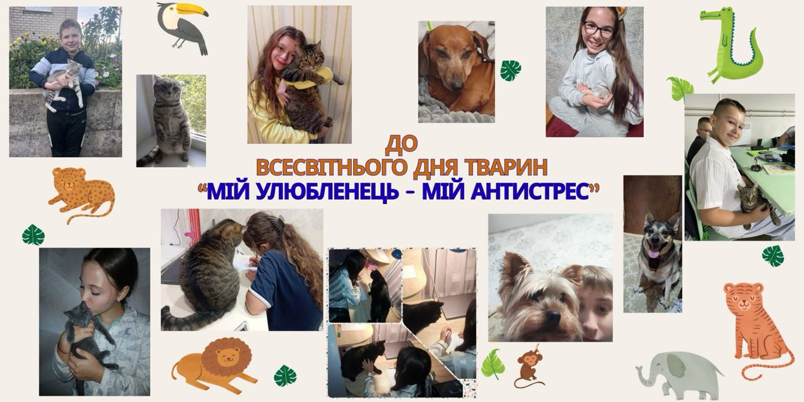
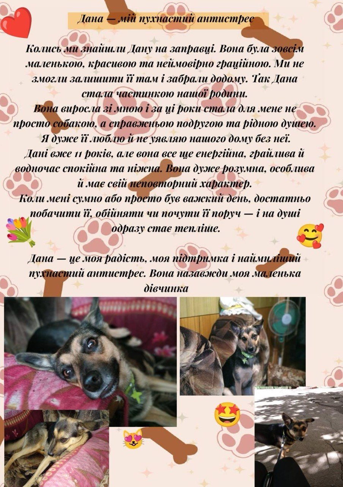

---
title: "До Всесвітнього дня тварин: пухнасті антистреси, які рятують гімназійні будні 🐾❤️"
---

Буває, що день абсолютно не задався? Багато уроків, за вікном похмуро, а новини навколо такі тривожні… Але варто лише почути тихе «мур-р-р», побачити радісний помах хвоста чи навіть спокійне плавання рибок в акваріумі — і на душі одразу стає тепліше. 🏡✨

До Всесвітнього дня тварин, який ми відзначали 4 жовтня, гімназія запустила особливий челендж! Ми вирішили показати, хто насправді є головним домашнім терапевтом і джерелом справжньої суперсили у будь-якій ситуації.

Це чудова нагода зайвий раз подякувати хвостикам, лапкам і пернатим за те, що вони роблять цей світ світлішим, а нас — спокійнішими. Вони нічого не кажуть, але завжди розуміють без слів.

Бережіть і щиро любіть своїх маленьких антистресів!

<Gallery>

</Gallery>

<FBVideo id="1746833376388118, 3605093326335270" ar="3:4" />
<FBVideo id="2216843482198659" ar="29:53" />
<FBVideo id="2226509331250056" ar="1:1.75" />
