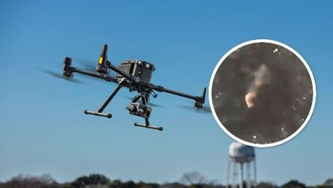
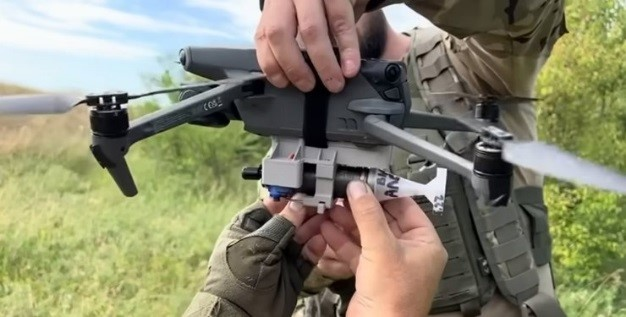

Російські війська останнім часом активно застосовують дрони-камікадзе проти України. У більшості випадків окупанти атакують цими дронами об’єкти інфраструктури, проте безпілотні літальні апарати несуть серйозну небезпеку і для цивільних.

Зазначимо, що дрони-камікадзе мають характерний звук — нагадує мотор мопеда чи бензопили. Під час польоту він дуже гучний, тому його можна почути навіть крізь сон. При цьому незважаючи на це, безпілотники літають на малій висоті, тому їх складно виявити системам протиповітряної оборони.

## Що робити під час атаки дронів-камікадзе:

- чуєте звук двигуна поряд — негайно прямуйте до укриття і залишайтеся там, доки мине небезпека;
- обирайте місця, які далеко від військових та стратегічних об’єктів, адміністративних установ;
- якщо немає можливості сховатися, дотримуйтесь правил двох стін, які повинні відокремлювати вас від небезпеки;
- найкраще при можливій атаці — перебувати у спеціально обладнаному укритті. Якщо такого поблизу немає, ховайтеся у підвалах чи цокольних поверхах будинків, підземних паркінгах та переходах.

## Що робити, якщо ви застали атаку на вулиці:

- знайдіть будь-який виступ, заглиблення у землі чи канаву. Укриттям на вулиці також може стати бетонна сміттєва урна або сходи;
- лягайте на землю і закрийте голову руками. Прийміть позу ембріона, розгорніться ногами у бік стрілянини, прикривши голову руками та відкрийте рот;
- якщо знайшли приміщення, вибирайте місце в кутку і недалеко від виходу, щоб миттєво залишити будинок у разі попадання снаряда. Залишайтеся в укритті щонайменше 10 хвилин після завершення обстрілу, адже існує загроза його повтору;
- не залишайтеся у транспорті під час обстрілу. Вийдіть та відбігайте подалі від дороги. І там знайдіть можливе укриття;
- ховатися у під’їздах, під арками, на сходових майданчиках, у підвалах панельних будинків, біля автомобільної техніки, автозаправних станцій також небезпечно. Намагайтеся не ховатися за автомобілями чи кіосками.
